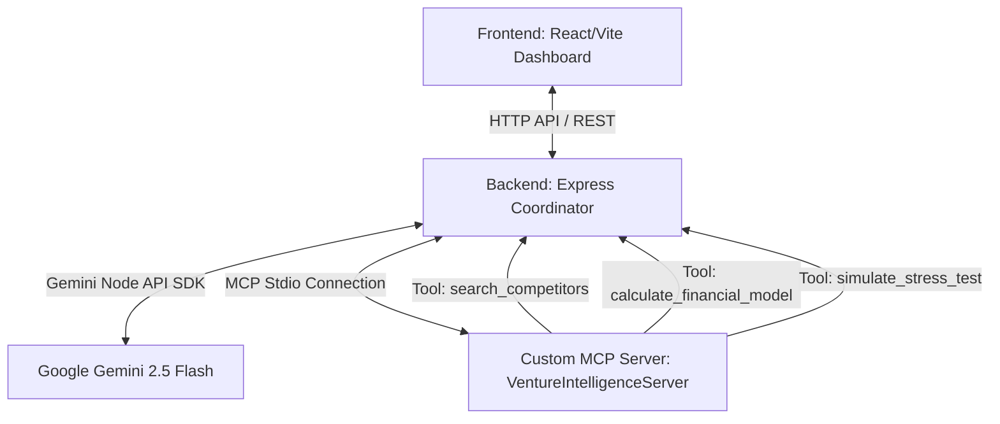

# ⚡ VentureSandbox - Autonomous Boardroom & Stress Tester

VentureSandbox is an interactive, multi-agent business simulation and stress-testing platform designed to help entrepreneurs validate their business models, map competitors, and evaluate product durability. 

This project was built for the **AI Agents: Intensive Vibe Coding Capstone Project** (Agents for Business Track). It demonstrates best practices in agent coordination, custom Model Context Protocol (MCP) server creation, and single-container cloud deployment.

---

## 🚀 Key Features

* **Multi-Agent Boardroom Debate**: Pitch your startup to a panel of 4 distinct, critical investor archetypes (Moonshot VC, Bootstrapper, Financial Auditor, Customer Advocate) who debate your idea and update a live canvas in real-time.
* **Auto-Syncing Lean Canvas**: A visual Business Model Canvas that updates its blocks, warnings, and vetoes live based on the boardroom conversation.
* **Competitor Positioning Chart**: A 2D SVG scatter plot comparing your product's pricing and features with real-world competitors identified by our market analyst agent.
* **Macroeconomic Stress Tests**: Run simulation events (e.g. Google launching a free copy of your product, ad pricing doubling, or churn spikes) and submit defense plans to test your startup's viability.
* **Calculated Viability Index**: A dynamic visual gauge representing your business model health based on payback period, runway, and LTV:CAC ratios.

---

## 🛠️ Architecture



* **Frontend**: Single Page Application built with React, Vite, and Lucide Icons, featuring a premium glassmorphic dark-mode interface.
* **Backend**: Express.js server orchestrating agent turns, storing session state, and acting as the client for the custom MCP server.
* **Custom MCP Server**: Implements the Model Context Protocol to expose core capabilities (competitor searches, financial metric calculations, and stress-test evaluation) directly to the AI agents.
* **Secure Key Isolation**: API keys are isolated on the backend server and never exposed to the client, utilizing strict CORS policies and schema enforcement.

---

## ⚙️ Local Installation & Setup

### Prerequisites
* Node.js v20 or later
* npm v10 or later
* Google Gemini API Key

### Steps

1. **Clone & Enter Project**:
   ```bash
   cd venture-sandbox
   ```

2. **Install Workspace Dependencies**:
   This monorepos uses npm workspaces. Run the following command at the root to install all frontend, backend, and MCP server packages:
   ```bash
   npm install
   ```

3. **Configure Environment Variables**:
   Create a `.env` file in the `backend/` directory:
   ```bash
   # backend/.env
   GEMINI_API_KEY=your_gemini_api_key_here
   PORT=5000
   ```
   *(If no API Key is set, the application automatically runs in a fully offline mock demo mode so judges can navigate the UI immediately).*

4. **Launch Development Services**:
   Start the backend server, custom MCP server, and Vite dev server simultaneously:
   ```bash
   npm run dev
   ```
   * Open your browser and navigate to `http://localhost:3000` to enter the boardroom.

---

## 🐳 Cloud Deployment (Google Cloud Run)

The application is dockerized for simple single-container deployment. The Express backend serves the React production build alongside the custom MCP server.

1. **Build the Docker Image**:
   ```bash
   docker build -t gcr.io/your-project-id/venture-sandbox:latest .
   ```

2. **Deploy to Cloud Run**:
   ```bash
   gcloud run deploy venture-sandbox \
     --image gcr.io/your-project-id/venture-sandbox:latest \
     --platform managed \
     --region us-central1 \
     --allow-unauthenticated \
     --set-env-vars GEMINI_API_KEY=your_gemini_api_key_here
   ```

---

## 🛡️ Security Features
* **Key Safety**: The `GEMINI_API_KEY` is maintained purely server-side.
* **Subprocess Isolation**: The custom MCP server runs as an isolated Node.js child process under the Stdio protocol.
* **Strict Schema Validation**: Tool requests and model outputs are validated against JSON schema models using Gemini's native `responseMimeType: "application/json"`.

---

## 🤖 Official ADK Multi-Agent Implementation

To fully satisfy the **Agent / Multi-agent system (ADK)** evaluation criteria, we have included an official ADK Python package in the [adk_boardroom/](file:///C:/Users/iamra/.gemini/antigravity/scratch/venture-sandbox/adk_boardroom) directory.

### ADK Directory Layout
- [__init__.py](file:///C:/Users/iamra/.gemini/antigravity/scratch/venture-sandbox/adk_boardroom/__init__.py): Exposes the package modules for auto-discovery.
- [agent.py](file:///C:/Users/iamra/.gemini/antigravity/scratch/venture-sandbox/adk_boardroom/agent.py): Implements the ADK boardroom coordinator, sub-agents (Astra VC, Rex Bootstrapper, Elena Auditor, Maya Customer Advocate), and their registered tools (`search_competitors`, `calculate_financial_model`, `simulate_stress_test`).

### How to Run in the ADK Playground
1. **Activate Python Environment & Install ADK**:
   ```bash
   pip install google-adk
   ```
2. **Launch the Playground**:
   Run `adk web` from the parent `venture-sandbox/` directory:
   ```bash
   cd venture-sandbox
   adk web
   ```
3. **Open the browser**:
   Navigate to `http://localhost:8000`. You will see `adk_boardroom` loaded in the agent selection dropdown. You can chat with the agents, run tools, and inspect traces directly inside the playground!
